# ForumProject
"Junior's Forum" it's a site for programmers, where you can read other users' posts, write your own posts, as well as express your thoughts in the form of comments under the posts.
When opening the site in guest mode, only the ability to read posts is available:
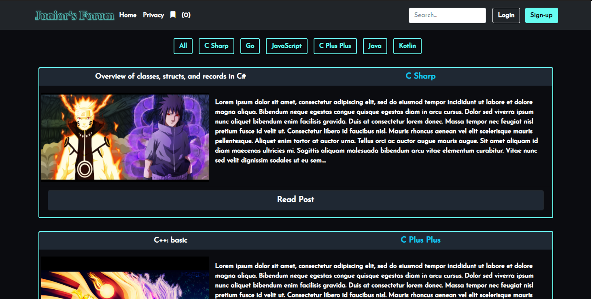
When you click on one of the filters with category names, only posts of the corresponding category will remain on the page.

Registration:
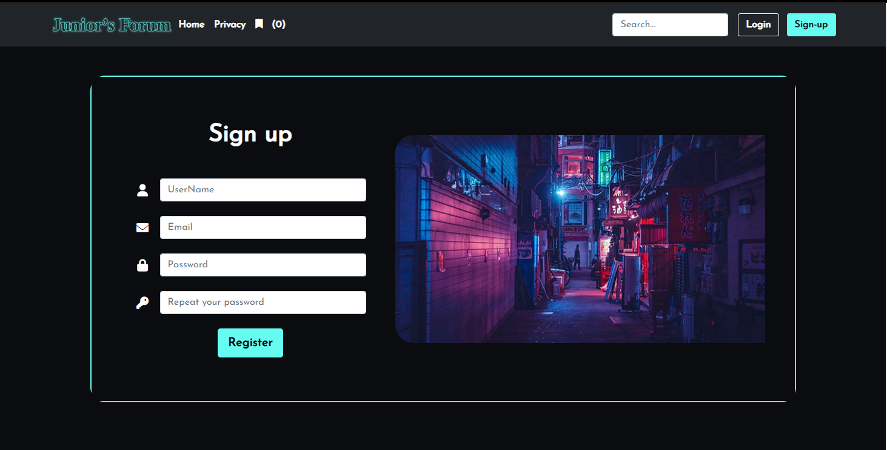

Login:
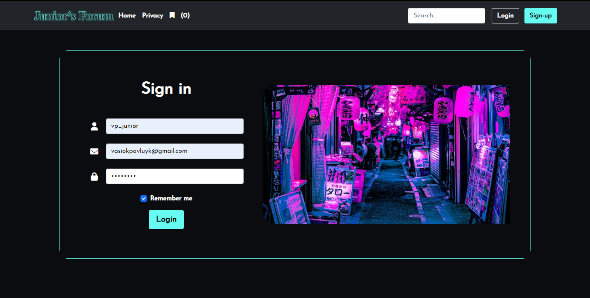

Now the work of the site is shown in case a user with SuperAdmin rights has logged in. A user with these rights has access to all posts, users, categories and more. He can delete posts from other users, change personal information, assign roles.

Example of role assignment:
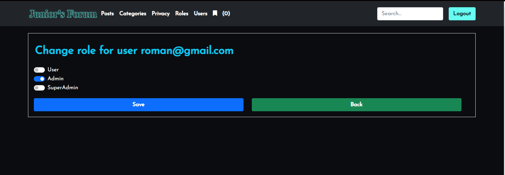

Access to user data:
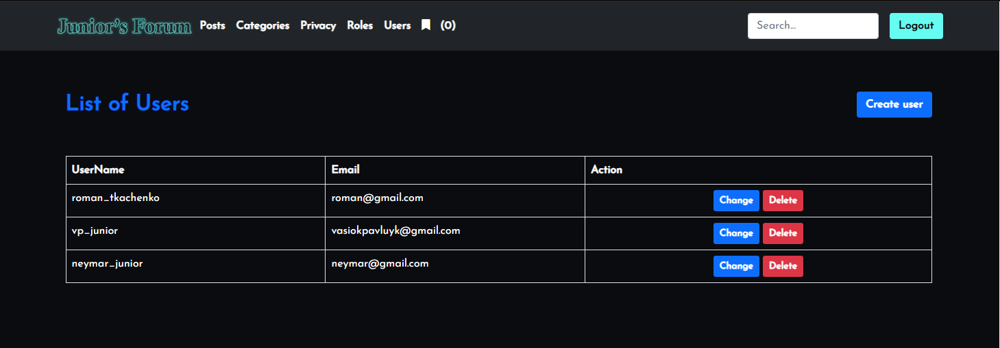

A page with all the categories of posts that are on the site:
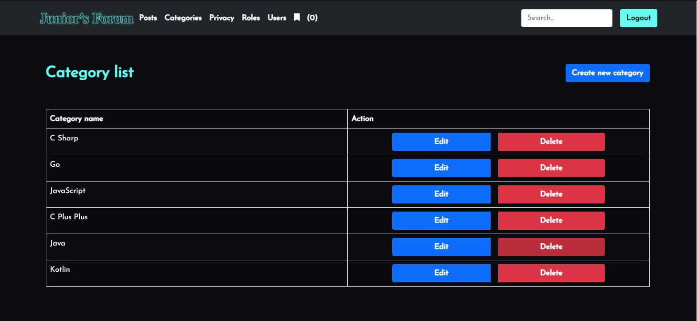

Ability to edit the post:
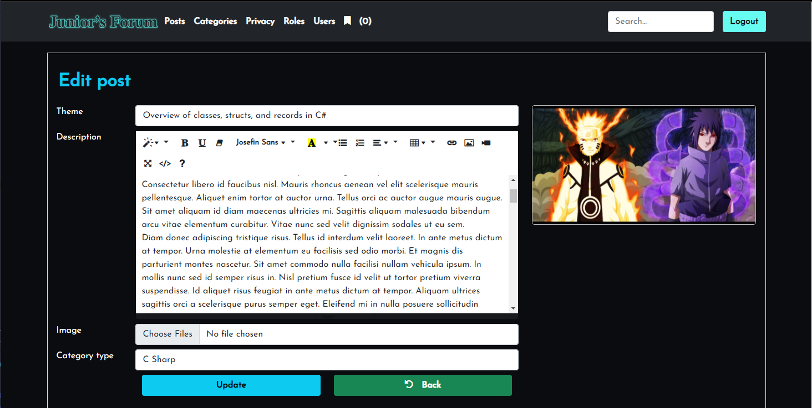

Create post:
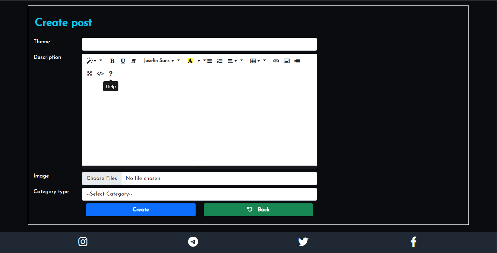

Then the whole article is presented. The date of creation, the author is displayed, there is an opportunity to put a like or a dislike:
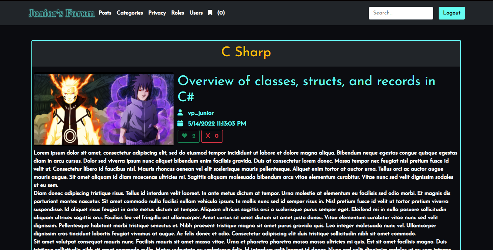

Below is the ability to add a post to saved, as well as the ability to write a comment:
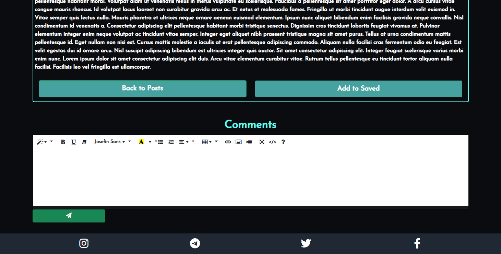

You can reply to the comment. Or, if you are the author of a comment, you can delete it.
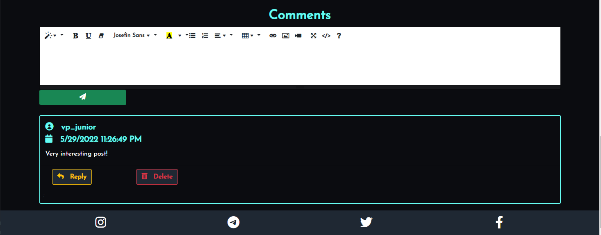

The saved page displays all the posts that the user has added to this list:
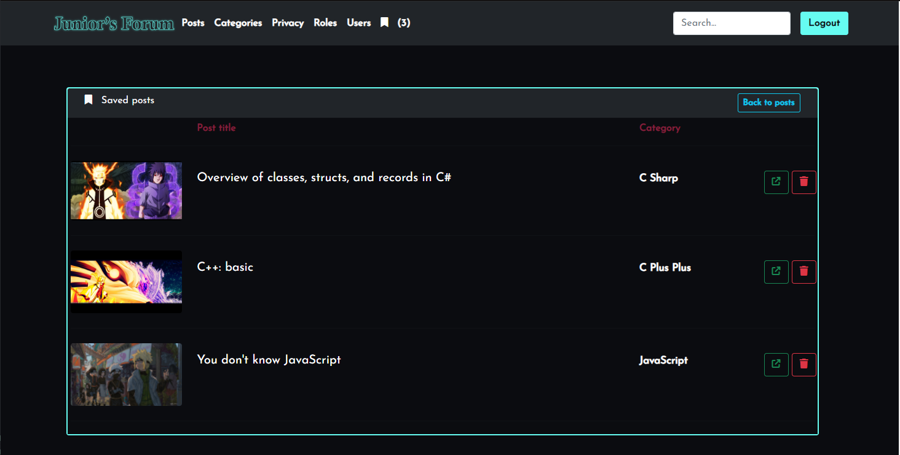